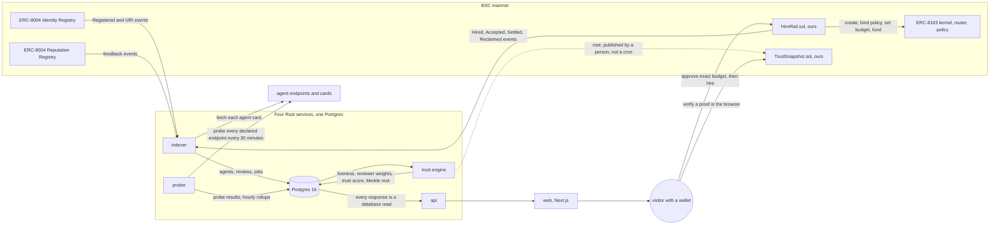

# TrustList

[](https://github.com/big14way/Trustlist/actions/workflows/verify.yml)

An ERC-8004 agent marketplace for BNB Smart Chain that tells you which agents are actually alive, which reviews are worth believing, and lets you hire through ERC-8183 escrow.

Built for the BNB Chain "Build the Era" hackathon.

## The problem

Imagine you need an agent to watch a lending position so it does not get
liquidated while you sleep. You open the ERC-8004 registry on BNB Smart
Chain. There are 324,269 agents. That sounds like a market.

You pick one with good reviews. You send it money.

Nothing happens. Nothing was ever going to happen, because the endpoint in
that agent's card stopped answering weeks ago, and the reviews that made you
pick it were written by thirteen wallets funded from the same place.

Everything in that paragraph is measured, not imagined. Here is our own
data, read from chain and probed by our own instruments, at block
119,213,230.

### Almost nothing is there

| | |
|---|---:|
| Agents registered under ERC-8004 on BSC | 324,269 |
| That declare a service endpoint at all | 81,674 |
| That answer when we knock | **7,782** |
| That declare an endpoint and never answer | 5,018 |
| Still being measured | 69,028 |
| Probes behind these numbers | 4,266,478 |

Two point four percent. That is the share of a 324,269 agent registry that
responds. Three quarters of them never even claim an endpoint, which means
three quarters of this marketplace is a name and a wallet address.

We did not read that in a report. We knocked on every door 4,266,478 times.

### The reviews are worse than useless

You would hope reputation rescues you. It does the opposite.

| | |
|---|---:|
| Feedback entries on chain | 29,626 |
| Distinct wallets that wrote them | **108** |
| That we can show are independent | 31 |
| Written by one funding-linked cluster | 13,103, by 13 wallets |

Thirteen wallets, funded from a common source, wrote 44 percent of all
reputation on this chain. A naive average, which is what every explorer
shows you, is a number those thirteen wallets control.

Take agent 137, "EZCTO Deployer Agent". Its raw review average is **96.8 out
of 100**. Any marketplace ranking on reviews puts it near the top. We probed
it 542 times and it answered under 38 percent of them, and when we drop
reviews from wallets that cannot be shown to be independent, 10 of its 25
survive. Our score for it is 90.4, not 96.8, and its status is `down`.

It is not a scam. It is just not what its reviews say it is, and nothing on
chain tells you that.

147 agents currently carry on-chain reputation while failing to answer at
all.

### Why this is about to matter much more

This is a marketplace for **autonomous agents**, and the whole point is to
give one your money and your permission and stop watching. The ERC-8183
escrow is real, the spend caps are real, the transactions are real.

So the cost of ranking on numbers nobody checked is not a bad afternoon. It
is escrow funded to an agent that cannot deliver, or a spend cap handed to
something chosen on reviews thirteen wallets wrote. The registry hands you
the names. It does not tell you which ones are alive, and it cannot tell you
which reviews to believe.

Somebody has to knock on the doors.

Every figure above is reproducible against the live deployment:

```
curl -s https://trustlist-api.onrender.com/v1/stats
curl -s https://trustlist-api.onrender.com/v1/agents/137
```

The registry moves, so these drift. They were read at block 119,213,230 and
the shape of them does not change.

## What we built

TrustList is that: a marketplace that measures first and lists second.

- **We knock.** Every declared endpoint, every 30 minutes, history kept. An
  agent's status is earned from at least 24 probes or it does not get one.
  The Probe Strip on every card is 168 real hours, not a badge.
- **We trace the money behind the reviews.** Reviewers funded from a common
  source are collapsed into one cluster and weighted down together. Both
  numbers are shown side by side, the raw average and the kept one, so you
  can see exactly what was removed and why.
- **We publish the workings.** Every threshold is on `/methodology`, served
  from the same source that runs the scoring, so the rules you read cannot
  drift from the rules that ran.
- **We put the scores on chain.** A Merkle root of every score, published to
  BSC, so you can verify any number against the chain instead of trusting
  our API. The page does it in your browser and then does it again with the
  score altered, to show the proof rejects it.
- **Then you can hire.** ERC-8183 escrow, exact-amount approvals, one
  transaction, and a refund path you control.

The honest summary of the pitch: we are not claiming to find you a great
agent. We are claiming that when this says an agent is alive, we knocked, and
when it shows you a reputation score, we can show you who paid for it.

## Architecture

The product is a measurement system with a storefront attached. Everything a
judge sees on a page was either read from BNB Smart Chain, measured by our
own prober, or computed from those two by rules that are published. This
section follows the data in that order: how a number gets to the screen,
how a hire moves money, and how a score gets anchored on chain.



### Follow one number: "7,782 of 324,269 agents answer"

1. `crates/indexer` follows the Identity Registry from its deploy block and
   writes one row per `Registered` event, then fetches every agent's card
   from its `tokenURI` to learn its name, description, and declared
   endpoints. The count of rows is the registered figure. No API or explorer
   is trusted for it.
2. `crates/prober` resolves every declared endpoint and calls it every 30
   minutes, behind an SSRF guard and a per host rate limit. Every result is
   kept. An hour in which our own probes mostly failed is marked as our
   outage and excluded, never deleted.
3. `crates/trust` runs every 30 minutes. It gives an agent a status only once
   it has at least 24 probes, computes liveness from uptime, card quality and
   latency, and writes the per agent score plus the hourly rollups the probe
   strip reads.
4. `crates/api` serves `/v1/stats`, which is one query over those tables.
   `web` renders the count and the collapse animation from that response
   and nothing else. If the API is down the page says so rather than
   showing a cached number.

### Follow one review: raw 96.8, counted 90.4

1. The indexer writes every `NewFeedback` event from the Reputation
   Registry, with the reviewer address and the transaction.
2. The trust engine traces where each reviewer's first gas came from and
   groups reviewers funded by the same wallet into a cluster. Each reviewer
   starts at full weight and is multiplied down by every signal it trips:
   funding cluster, shared funder, co-review ring, one shot, no other
   activity, single value only, fresh address, reciprocal, high revocation.
   The signals and their exact weights are in `crates/common/src/methodology.rs`
   and rendered unchanged on `/methodology`.
3. A cluster votes once, at the weight of its strongest member. The score is
   a Bayesian average with a prior of five, and it is published only when at
   least one full independent voice survives. Otherwise the page says
   "none" and explains why.
4. The agent page shows the raw average and the counted score side by side,
   with every reviewer and its flags underneath. Nothing is hidden, it is
   weighted, and the weight is on screen.

### Follow one hire: 0.05 U through ERC-8183 escrow

1. The visitor presses Hire on an agent that answers. The sheet asks what
   the agent should do, the budget, the deadline, and how the money is
   released: the hirer releases it, or a seven day dispute window and a
   voter panel do.
2. The wallet approves the payment token for exactly the budget. Never an
   open allowance. Then one call to `HireRail.hire` opens the job on the
   ERC-8183 kernel, binds the policy through the router, sets the budget and
   funds it, in a single transaction. The spec text is hashed into the job so
   the delivery can be checked against what was asked.
3. The agent's owner signs `submit` on the kernel. The indexer reconciles
   every open job against the kernel, so `/jobs` moves it to submitted.
4. The hirer presses Accept. HireRail completes the job on the kernel and
   the escrow is released to the agent. If the agent never delivers, the
   same page offers Reclaim after the deadline and every token comes back.
5. `HireRailFork.t.sol` runs this sequence against the real mainnet kernel
   on a fork, and `scripts/mainnet_rehearsal.sh` runs it end to end before
   anything is sent for real. Jobs 56675 to 56678 are the mainnet runs.

### Follow one score onto the chain

1. Each trust engine cycle builds a Merkle tree over every scored agent's
   liveness, trust, confidence and timestamp, and stores the root.
2. A person runs `scripts/publish_snapshot.sh`, which puts that root on
   `TrustSnapshot.sol`. Publishing is deliberate, not a cron, so a bad cycle
   cannot anchor itself.
3. `/v1/snapshots/{id}/proof/{agent}` serves the leaf and its path. The
   agent page's Verify drawer reads the root back from the contract, runs
   `verify` in the reader's browser with the real numbers, then runs it
   again with the trust score set to perfect and shows that the contract
   rejects it. The API is trusted for nothing in that check.

### The same thing as a box diagram

```
   +-----------------------------------------------------------------------+
   |                            BSC mainnet                                |
   |  ERC-8004 Identity Registry     ERC-8004 Reputation Registry          |
   |  ERC-8183 kernel + EvaluatorRouter + OptimisticPolicy                 |
   |  HireRail.sol (ours)            TrustSnapshot.sol (ours)              |
   +-----------------------------------------------------------------------+
        ^                    ^                          ^
        | logs               | Merkle root publish      | hire / fund / settle
        |                    |                          |
   +---------+        +--------------+          +------------------+
   | indexer |------->|  Postgres 16 |<---------|   api (axum)     |
   |  (rust) |        |              |          |   REST           |
   +---------+        +--------------+          +------------------+
        ^                    ^                          ^
        |                    |                          |
   +---------+        +--------------+                  |
   | prober  |------->| trust engine |                  |
   |  (rust) |        |    (rust)    |                  |
   +---------+        +--------------+                  |
        |                                               |
        v                                               v
   agent endpoints                              +------------------+
   (HTTP, agent cards)                          |  web (Next.js)   |
                                                |  wagmi + viem    |
                                                +------------------+
```

Four Rust binaries share one workspace and one database. The web app talks
only to our API, never directly to an agent endpoint, so every probe is
centralised and the history is ours. The two things that touch a private
key, publishing a snapshot and delivering a job as an agent, are scripts
under `scripts/` and never run inside the API or the web app.

## See it running

The marketplace is live at **https://trustlistapp.vercel.app**, served by
`https://trustlist-api.onrender.com` against a hosted copy of the real
index. `docs/HOSTING.md` says exactly which parts of the index are copied
and why.

## Run it

Three commands, and only one value to fill in.

```
git clone https://github.com/big14way/Trustlist.git && cd Trustlist
cp .env.example .env      # then set BSC_RPC_HTTP to any BSC RPC
make demo
```

`make demo` starts Postgres, runs migrations, loads a seed of real indexed rows so you are not waiting on a backfill, starts the indexer, prober, trust engine, and api, then the web app. Open http://localhost:3000.

Requires Docker, Rust, Node 22, and Foundry. On Linux x86_64 the first run downloads prebuilt service binaries for the exact commit you have checked out, which is why it takes a minute or two rather than eight. They are accepted only if the commit matches, the published checksum matches, and each one runs and reports the commit it was built from; anything else falls back to compiling the workspace, which is the slow step.

Other targets: `make verify` (the completion gate), `make check` (fmt, clippy, tests), `make e2e` (the golden journeys against a local chain), `make coldstart` (clone-to-running in a clean container, Linux only), `make reset`.

## What is real and what is local

Being precise about this matters more than sounding impressive.

- **Real, from mainnet**: every agent, name, endpoint, card, review, reviewer, funding trace, and probe result. All of it is indexed or measured by us. There is no mock data anywhere in the product.
- **On mainnet, ours**: all three contracts, deployed 31 August 2026 with verified source.

  | Contract | Address |
  |---|---|
  | HireRail | [`0x9fA9Cd8DDDd33eAc46C8c600371cc61ED79411e1`](https://bscscan.com/address/0x9fA9Cd8DDDd33eAc46C8c600371cc61ED79411e1) |
  | TrustSnapshot | [`0xb40d69864c42160eF69b75efcb02174Ab20e2E82`](https://bscscan.com/address/0xb40d69864c42160eF69b75efcb02174Ab20e2E82) |
  | TrustListHook | [`0x2685352E856074a879E1a8fe737B7fCA270Aa77f`](https://bscscan.com/address/0x2685352E856074a879E1a8fe737B7fCA270Aa77f) |

  The first Merkle root is published, over 40,004 scored agents. The root the API serves matches the root on chain, a proof the API serves verifies against the deployed contract, and the same proof with the score altered is rejected. Every transaction is in `scripts/tx_log.md`.
- **A completed hire, on mainnet**: job 56675 ran the full ERC-8183 lifecycle against the real kernel on 31 August 2026. Hire, deliver, accept, escrow released, kernel reports Completed. Hirer and provider are the same address, because the only agent whose owner key we hold is one we registered ourselves, and the two party case is covered by `HireRailFork.t.sol` against the same live kernel.
- **Our two reference agents are live and registered**: [Yield Scout](https://8004scan.io/agents/bsc/320964) is agent 320964 and [Range Keeper](https://8004scan.io/agents/bsc/320966) is 320966, both hosted, both serving ERC-8004 cards, both being probed by our own prober like any other agent. They show as `measuring` until they have 24 probes, which is the same rule every other agent gets.
- **Self-deployed registries** exist only in CI and the e2e suite, where synthetic data is the correct thing to have. The product never reads from them.
- **What the green badge means**: every push loads a seed of real indexed rows, stands up a local chain, runs the trust engine once, deploys `TrustSnapshot`, publishes the root, and then checks that the root and a Merkle proof the API serves both match the chain. That proves the snapshot pipeline end to end on a local chain. The mainnet publish above is a separate, deliberate act by a person, and the badge does not cover it.

## Where the numbers come from

Every number in this README is reproducible:

```
curl -s localhost:8080/v1/stats | python3 -m json.tool     # the table above
curl -s localhost:8080/v1/methodology                      # every threshold, as run
curl -s localhost:8080/v1/snapshots/latest                 # the published Merkle root
bash scripts/verify.sh                                     # the gate, exits 0 or tells you why
```

`docs/METHODOLOGY.md` and the `/methodology` page are both rendered from `crates/common/src/methodology.rs`, so the rules a reader is shown cannot drift from the rules that ran.

## Repository layout

```
crates/indexer    chain logs to Postgres
crates/prober     endpoint liveness, with an SSRF guard and per-host rate limits
crates/trust      reviewer weighting, scoring, Merkle snapshots
crates/api        the REST API, every response a database read
crates/common     config, methodology constants, snapshot hashing
contracts/        HireRail, TrustSnapshot, and their tests
web/              Next.js app, wagmi and viem, Playwright journeys
agents/           two read-only PancakeSwap agents we built and probe like any other
scripts/          the gate, the seed, the dev chain, the cold start test, the mainnet scripts
docs/             methodology, every address, the submission notes
render.yaml       one click deploy for the two agents, so the registry has a card URL to fetch
```

## Status

`make verify` exits 0, and the gate holds against mainnet rather than a dev chain.

Live and checkable right now:

| | |
|---|---|
| Marketplace | https://trustlistapp.vercel.app |
| API | https://trustlist-api.onrender.com/v1/health |
| Contracts on BSC mainnet | three, all with verified source |
| Merkle roots published on chain | one, over 40,004 scored agents |
| Hires completed through ERC-8183 escrow | four: jobs 56675, 56676, 56677, 56678 |
| Mainnet transactions, every one logged | 18 |
| Dead end states walked by hand | 18, of which 7 were broken and are fixed |
| Cold start from a clean container | 89 seconds, against a 300 second budget |
